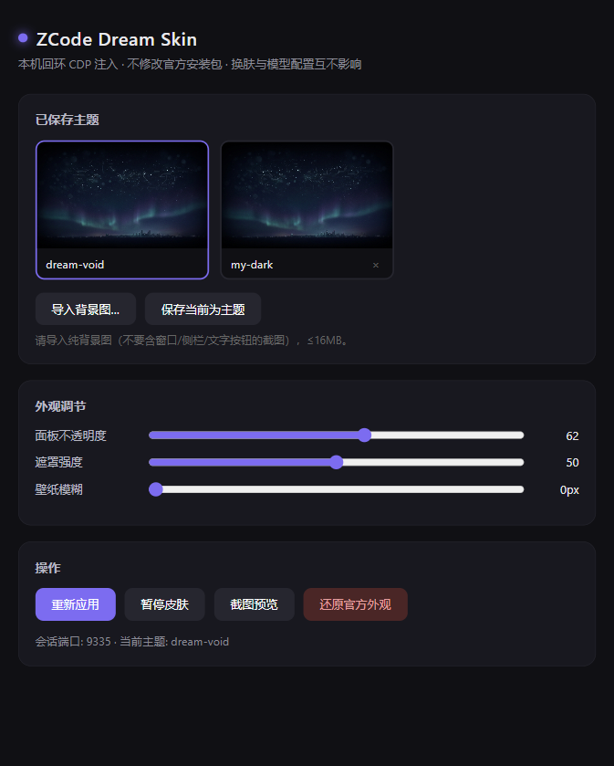

# ZCode Dream Skin

给 [ZCode](https://zcode.z.ai/cn) 桌面端换一张会呼吸的脸。

外部主题 / 换肤工具 · 本机回环 CDP 注入 · 不改官方安装包

一张图，一种心情 · 写代码，也要有氛围感

> 非 Z.ai 官方产品。不修改 ZCode 安装目录、`app.asar` 或应用签名。
> 灵感与架构致敬 [Codex-Dream-Skin](https://github.com/Fei-Away/Codex-Dream-Skin)。



## 它能做什么

- **真·可交互**：侧栏、对话、代码块、输入框都是原生控件，不是整窗假截图贴上去
- **真背景层**：一张壁纸连续铺满整窗，面板与代码块全部呈玻璃态半透明
- **代码块融合**：Shadow DOM（`diffs-container`）穿透注入，代码块不再是突兀的不透明色块
- **自适应遮罩**：canvas 采样壁纸亮度，自动推导遮罩强度，深浅主题切换自动重建配色
- **可换图**：导入自己喜欢的纯背景图，一键变成主题
- **可存主题**：保存/切换多套主题
- **可恢复**：一键还原官方外观，随时 100% 可逆
- **相对安全**：CDP 只绑 127.0.0.1，不改官方二进制与签名

## 运行要求

- Windows 10 或更高版本（当前仅支持 Windows）
- 已安装的 ZCode 桌面端
- Node.js **22** 或更高版本（使用原生 WebSocket / fetch，零依赖）

## 快速开始

```powershell
git clone <this-repo>
cd zcode-dream-skin

# 以换肤模式启动 ZCode（已运行时会先询问是否重启）
node bin/zds.js start

# 打开控制面板（换图、滑杆调节、保存主题）
node bin/zds.js panel
```

首次启动后，皮肤即注入完成。日常使用只需要 `start` 和 `panel` 两个命令。

## 命令一览

| 命令 | 说明 |
| --- | --- |
| `zds start [--yes]` | 以换肤模式启动 ZCode（必要时先优雅关闭） |
| `zds panel` | 打开 Web 控制面板（主题管理、透明度/遮罩/模糊滑杆） |
| `zds apply` | 重新应用当前主题 |
| `zds use <主题名>` | 切换主题 |
| `zds save <主题名>` | 把当前外观保存为主题 |
| `zds list` | 列出全部主题 |
| `zds set-bg <图片>` | 导入背景图并应用（PNG/JPEG/WebP，≤16MB） |
| `zds opacity <0-100>` | 面板不透明度（越大越实，建议 50-65） |
| `zds cards <0-100>` | 卡片/代码块不透明度（建议 45-60） |
| `zds scrim <0-100\|auto>` | 壁纸遮罩强度 |
| `zds blur <0-40>` | 壁纸模糊 px |
| `zds pause` / `zds resume` | 暂停 / 恢复皮肤 |
| `zds restore [--yes]` | 一键还原官方外观（可选重启 ZCode） |
| `zds status` | 查看状态 |
| `zds shot [文件]` | 截图（调试用） |

## 工作原理

```
ZCode.exe --remote-debugging-port=<port> --user-data-dir=<默认数据目录>
        │
        ▼
CDP (127.0.0.1) ──► 渲染页注入三层内容：
  1. 壁纸层（z-index:-2，pointer-events:none）
  2. 遮罩层（亮度自适应渐变，保证文字可读）
  3. CSS 变量重写（--color-card 等 Tailwind 变量内联重定义为同色 rgba，
     面板/卡片/弹窗级联半透明；Shadow DOM 内部 pre 透明化）
        │
守护进程 watchdog ──► 页面刷新/导航后自动补注；ZCode 退出后自动退出
```

关键技术点：

- **Chromium M136+ 限制**：远程调试必须显式传 `--user-data-dir` 才被接受，启动器已处理（指向 ZCode 同一个默认数据目录，登录态/数据不受影响）
- **变量级透明化**：不重写零散类名，而是采样 ZCode 的 7 个 Tailwind CSS 变量原色，内联重定义为带 alpha 的同色——深浅主题自动适配，且 CSS 变量天然穿透 Shadow DOM
- **Shadow DOM 穿透**：对 `diffs-container` 的 shadow root 追加样式，让代码块内部 `pre` 透明、透出卡片底色；页面内 MutationObserver 自动处理新生成的代码块

## 文件与日志位置

| 用途 | 路径 |
| --- | --- |
| 状态根目录 | `%LOCALAPPDATA%\ZCodeDreamSkin` |
| 当前状态 | `%LOCALAPPDATA%\ZCodeDreamSkin\state.json` |
| 已保存主题 | `%LOCALAPPDATA%\ZCodeDreamSkin\themes` |
| 导入图片归档 | `%LOCALAPPDATA%\ZCodeDreamSkin\images` |
| 注入器日志 | `%LOCALAPPDATA%\ZCodeDreamSkin\injector.log` |

## 常见问题

**ZCode 更新后皮肤失效？**
重新 `node bin/zds.js start` 即可。工具不依赖 ZCode 安装路径与版本文件，若官方大幅改动 DOM/变量命名，面板可能恢复不透明（功能不受影响），等待工具适配更新。

**端口被占用？**
启动器会从 9335 起自动寻找空闲端口。

**如何彻底还原？**
`node bin/zds.js restore`，或直接正常启动 ZCode（不带我们的启动参数）——注入只存在于内存，无任何文件残留。

## 安全边界

- CDP 只绑 `127.0.0.1`，皮肤运行期间不要运行来路不明的本机程序
- 不修改 ZCode 安装目录、`app.asar` 或代码签名
- 不读取、不写入 API Key / Base URL / 模型供应商配置
- 还原脚本只会控制经过进程路径与会话状态校验的 ZCode 进程

## 许可

MIT · 非 Z.ai 官方产品；ZCode 及相关权利归其权利人。内置预设壁纸由 AI 生成，仅作主题示意。
